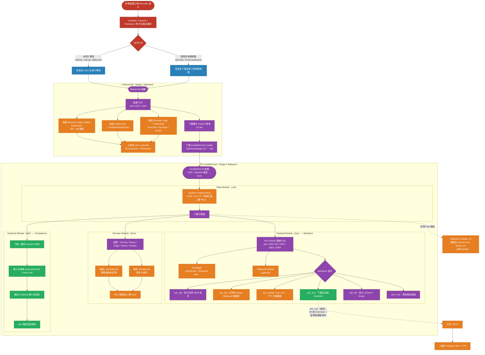

```mermaid
flowchart TD
    classDef attacker fill:#c0392b,color:#fff,stroke:#922b21
    classDef victim  fill:#2980b9,color:#fff,stroke:#1a5276
    classDef malware fill:#8e44ad,color:#fff,stroke:#6c3483
    classDef exfil   fill:#e67e22,color:#fff,stroke:#ca6f1e
    classDef persist fill:#27ae60,color:#fff,stroke:#1e8449
    classDef note    fill:#f0f0f0,color:#333,stroke:#aaa,stroke-dasharray:4 4

    %% ── Phase 1：建立假身分 ──
    A1([攻擊者建立假 Recruiter 身分]):::attacker
    A2[LinkedIn / Upwork / Freelancer 等平台發送邀約]:::attacker
    A3{交付方式}:::attacker

    A1 --> A2 --> A3

    A3 -->|木馬化專案\nGitHub / GitLab / Bitbucket| B1
    A3 -->|假視訊會議軟體\nMiroTalk / FreeConference| B2

    %% ── Phase 2：Initial Access ──
    B1[受害者 clone 並執行專案]:::victim
    B2[受害者下載並執行假會議軟體]:::victim

    %% ── Phase 3：BeaverTail ──
    B1 & B2 --> C0

    subgraph BeaverTail ["🦫 BeaverTail（Stage 1 Malware）"]
        direction TB
        C0([BeaverTail 啟動]):::malware
        C1[連線 C&C\nport 1224 / 1244]:::malware
        C2[竊取 Browser Crypto Wallet Extensions\n.ldb / .log 檔案]:::exfil
        C3[竊取 Solana Key\n~/.config/solana/id.json]:::exfil
        C4[竊取 Browser Login Credentials\nKeychain / Keyrings / Firefox]:::exfil
        C5[上傳至 C&C /uploads\n含 hostname + timestamp]:::exfil
        C6[下載獨立 Python 環境\np2.zip]:::malware
        C7[下載 InvisibleFerret Loader\n/client/campaign_ID → .npl]:::malware

        C0 --> C1
        C1 --> C2 & C3 & C4
        C2 & C3 & C4 --> C5
        C1 --> C6 --> C7
    end

    %% ── Phase 4：InvisibleFerret ──
    C7 --> D0

    subgraph InvisibleFerret ["🐭 InvisibleFerret（Stage 2 Malware）"]
        direction TB
        D0([InvisibleFerret 啟動\nXOR + Base64 解密 → exec]):::malware

        subgraph Main ["Main Module（.npl）"]
            D1[System Fingerprinting\nUUID / OS / IP / 地理位置\n→ 上傳 /keys]:::exfil
            D2[下載子模組]:::malware
        end

        subgraph Payload ["Payload Module（pay）— Backdoor"]
            P1[TCP Socket 連線 C&C\nport 1245 / 80 / 2245 / 3001 / 5000]:::malware
            P2[Keylogger\npyWinHook（Windows only）]:::exfil
            P3[Clipboard Stealer\npyperclip]:::exfil
            P4{Backdoor 指令}:::malware
            P4a[ssh_obj：執行任意 Shell 指令]:::malware
            P4b[ssh_clip：回傳 Keylog / Clipboard 緩衝區]:::exfil
            P4c[ssh_upload / ssh_env：FTP 外傳檔案]:::exfil
            P4d[ssh_any：下載並安裝 AnyDesk]:::persist
            P4e[ssh_kill：終止 Chrome / Brave]:::malware
            P4f[ssh_cmd：清除感染痕跡]:::malware

            P1 --> P2 & P3
            P1 --> P4
            P4 --> P4a & P4b & P4c & P4d & P4e & P4f
        end

        subgraph Browser ["Browser Module（bow）"]
            BR1[目標：Chrome / Brave / Edge / Opera / Yandex]:::malware
            BR2[竊取 LoginData.db\n瀏覽器儲存密碼]:::exfil
            BR3[竊取 webdata.db\n信用卡資訊]:::exfil
            BR4[AES 解密後上傳 /keys]:::exfil

            BR1 --> BR2 & BR3 --> BR4
        end

        subgraph AnyDesk ["AnyDesk Module（adc）— Persistence"]
            AD1[下載 / 確認 AnyDesk 存在]:::persist
            AD2[植入攻擊者 password hash / token salt]:::persist
            AD3[重啟 AnyDesk 載入新設定]:::persist
            AD4[adc 模組自我刪除]:::persist

            AD1 --> AD2 --> AD3 --> AD4
        end

        D0 --> D1 --> D2
        D2 --> P1
        D2 --> BR1
        D2 --> AD1
    end

    %% ── 2024/08 更新版 ──
    P4d -.->|ssh_zcp（新版）\n88 個 Extension +\n密碼管理器資料| E1
    E1[打包 ZIP/7z]:::exfil --> E2[上傳至 Telegram Bot + FTP]:::exfil

    %% ── 2024/12 新增 ──
    D2 -.->|新增 mlip 模組| M1
    M1[Clipboard Stealer 2.0\n僅監控 chrome.exe / brave.exe\n→ 上傳 /api/clip]:::exfil
```
